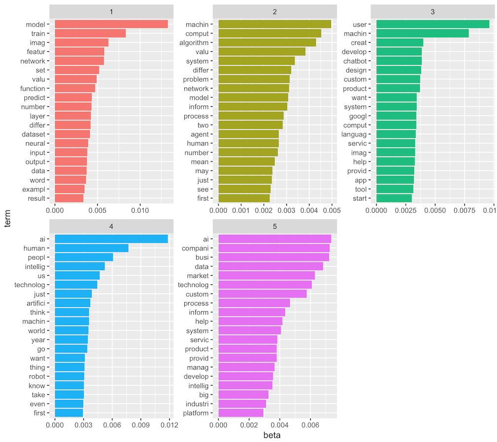

# shinyapp-medium-datasci

- **Hosted at** https://jennalandy.shinyapps.io/medium_datasci/
- **Based off** of medium data science article dataset from [the R for Data Science Tidy Tuesday data repository](https://github.com/rfordatascience/tidytuesday/tree/master/data/2018/2018-12-04). 

## Purpose: Article Recommendation and Inspection of Topic Popularity
The first panel fo this app acts as a data science article recommendation platform, including a selection panel of topics a user may be interested in. Depending on what is selected, the five most popular related articles and authors will be displayed, as well as a table of all related articles that can be searched. All articles and authors are linked for easy access to the medium articles themselves.

The second panel is to inspect topic popularities over time. Again, the user can select topics of interest. Here, they can also select what popularity metric to inspect: claps reflects popularity among readers, while number of articles represents popularity among writers (i.e. how many authors want to write on a given topic?). Time range and aggregation function are also user-defined.

## Process: Web Scraping and Topic Modeling
The tags provided (ai, big data, data science, data visualization, deep learning, machine learning, and just 'data') are not very specific and I hoped to get some more interesting categories. To do this, I performed topic modeling on the full text of each article. I first used the urls provided in the dataset to scrape the full text of each article using the rvest package. Topics of interest were then determined with latent dirichlet allocation topic modeling using the topicmodels package. LDA was only fit on a random 3,000 articles for the sake of time. For the full dataset of 78,388 articles, I recorded its topic distribution (gamma values for each topic.

Code for web scraping, lda modeling, and lda fitting can be found in topic_modeling/scraping.R

Below is a plot of the 20 most common words in each topic of the LDA topic modeling results. I experimented with different numbers of topics, and five seemed to be a happy medium where groups didn't overlap too much and there weren't duplicate topics.

<!--  -->

Putting these topics into context and combining them with the tag information, I decided on the following topics of interest:

1. Deep Learning and Neural Networks: topic 1, tag_deep_learning, tag_big_data
2. Machine Learning and Algorithms: topic 2, tag_macine_learning
3. App, Software, and Chat Bot Development: topic 3
4. Artificial Intelligence, Human Computer Interaction: topic 4, tag_ai, tag_artificial_intelligence
5. Industry and Business: topic 5
6. Data Visualization: tag_data_visualization

I define an article as fitting one of these topics of interest if (a) it is tagged appropriately (not applicable for topics 3 and 5) or (b) the gamma value associated with its topic is over 0.5.

Code for preprocessing of data into topics can be found in process_data.R.

## Reflection: Interesting Discoveries
Below are a few intersting discoveries I made in the process of creating and playing around with this application.

Looking at the number of articles across topics, it is clear that machine learning is an all time favorite among authors. On the other end of the spectrum, deep learning and neural networks are rarely written about. The number of articles on app, software, and chat bot development has gone down in popularity over the past two years while all other topics have increased.

On the other hand, when we inspect the median number of claps across topics, machine learning is relatively unpopular (typically 5 claps per article), while neural networks were significntly more popular (up to 25 claps per article) up until recently, when neural networks lowered down to the level of ML. Though it changes throughout the dataset, most recent data indicates that data visualization articles are slighlty more popular than the rest, with around 7 claps per article. Articles about industry and business are the least popular, between 1 and 2 claps per article.

Articles about artificial intelligence, human computer interaction, and data visualization are, on average, about 1-2 minutes longer to read than articles on other topics. Articles about business and industry are the shortest at around 3.5 minutes to read. However, all median reading times are very similar, between 3 and 4 minutes.
